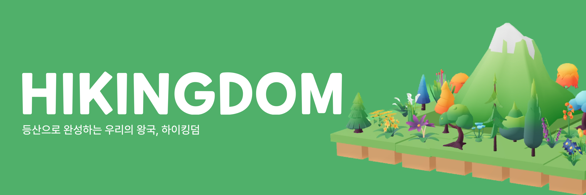

# HIKINGDOM

## 1. 서비스 소개

젊은 층에 등산 열풍이 불고 있습니다. 진입 장벽이 낮고, 소확성(작지만 확실한 성취) 트렌드가 되면서 등산을 중심으로 젊은 층만의 문화가 나타나고 있습니다.

다만, 등산이 기성세대의 전유물이라는 인식 때문에 대부분의 등산 서비스는 기성세대를 대상으로 하고 있습니다. 단순 정보 기록 및 공유에만 멈춰있어 젊은 세대만의 등산 문화를 공유할 수 있는 맞춤형 서비스가 부족합니다.

HIKINGDOM은 다음을 대상으로 등산에 필요한 모든 서비스를 한 애플리케이션 내에서 해결하고자 만든 애플리케이션입니다.

- 등산을 시작하는 젊은 세대
- 꾸준한 등산을 위한 동기부여를 얻고 싶은 사람
- 친구들과 등산 모임을 꾸려가고 싶은 사람
- 등산을 소중한 추억으로 기록하고 싶은 사람

## 2. 주요 기능

## 3. 기술 스택

<table align="center">
  <tr>
    <td align="center" width="165"><strong>Frontend</strong></td>
    <td>
      

        
        
        
        
      

    </td>
  </tr>
  <tr>
    <td align="center" width="165"><strong>Backend</strong></td>
    <td>
        
        
        
         
        
        
        
    </td>
  </tr>
  <tr>
    <td align="center" width="165"><strong>Android</strong></td>
    <td>
        
        
    </td>
  </tr>
  <tr>
    <td align="center" width="165"><strong>Infra</strong></td>
    <td>
        
        
        
         
        
        
    

  </tr>s
<table>
